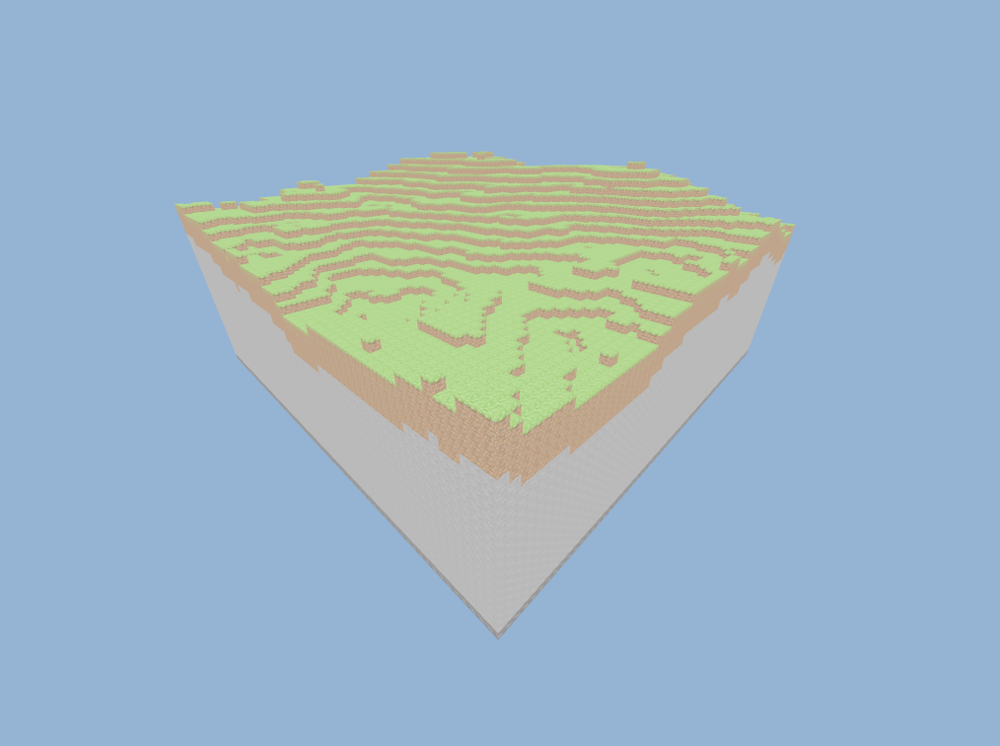
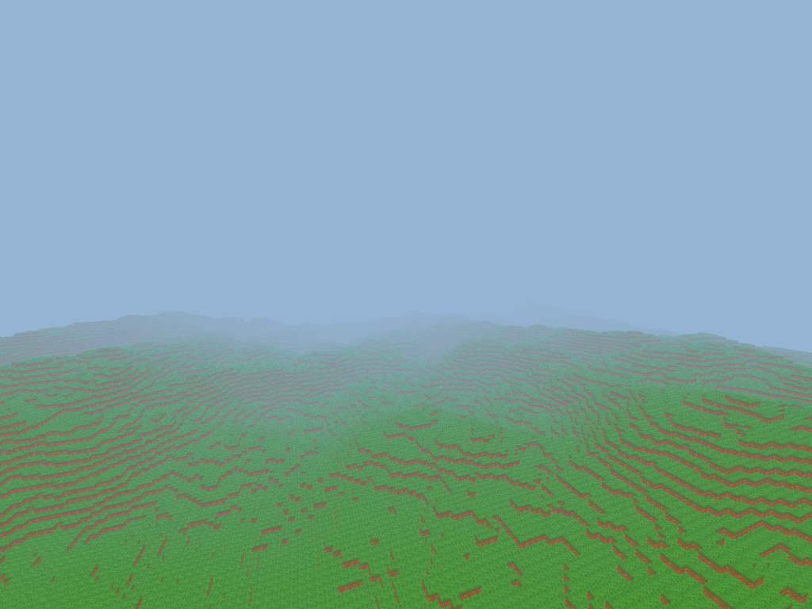

## Voxel Game

  

This is a personal side project to learn some concepts about computer graphics, game development and get more comfortable using Rust.

### Features
This is a list containing all of the planned features and their current state.

#### Technical
  - [ ] Terrain
       - [x] Greedy meshing
       - [ ] Procedural Terrain
       - [ ] Saving/Loading
  - [ ] Rendering
       - [ ] Transparency [water, glass]
       - [ ] Custom mesh [foliage, etc.]
       - [ ] Lighting & Shadows
       - [ ] Post processing
  - [ ] Physics
       - [ ] Collision
  - [ ] Filesystem
  - [ ] Graphical User Interface
       - [ ] Text
       - [ ] Container
       - [ ] InputText
       - [ ] Button
       - [ ] Slider
  - [ ] Multiplayer
  - [ ] Modding

#### Gameplay
  - [ ] Player
       - [x] Movement
       - [ ] Hotbar & inventory
       - [ ] Model
       - [ ] Health, hunger & others
  - [ ] Structures
  - [ ] Camera
      - [x] Free Camera
      - [ ] First Person
      - [ ] Third Person
  - [ ] Audio
       - [ ] Sound effect
       - [ ] 3D Sound
       - [ ] Background music
  - [ ] Mobs
      - [ ] Behaviour tree
      - [ ] Path finding

## Controls
  - `WASD`  to move around
  - `Space/Shift` to go up/down

## Screenshots
##### Version 0.1.0
  
##### Version 0.1.1
      

## Contributing
Pull requests are welcome. For major changes, please open an issue first to discuss what you would like to change.

## Resources
### Inter Font
Inter is a typeface specially designed for user interfaces with focus on high legibility of small-to-medium sized text on computer screens.
Get in on the [site](https://rsms.me/inter/) or [repo](https://github.com/rsms/inter).

## License
[GNU GPLv3](https://www.gnu.org/licenses/gpl-3.0.en.html)
