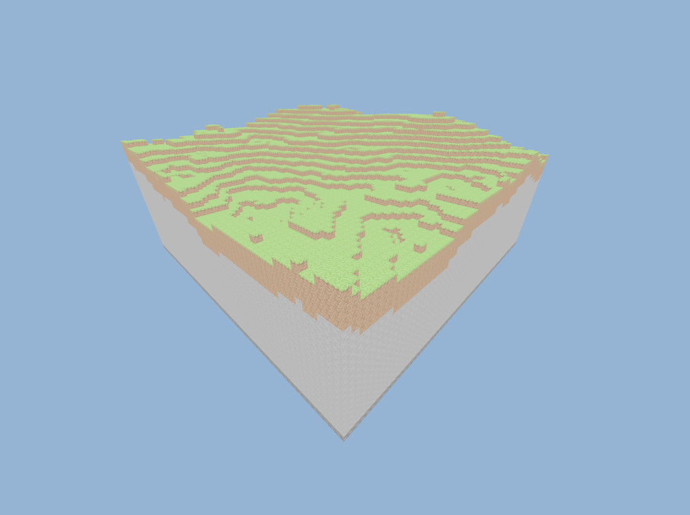
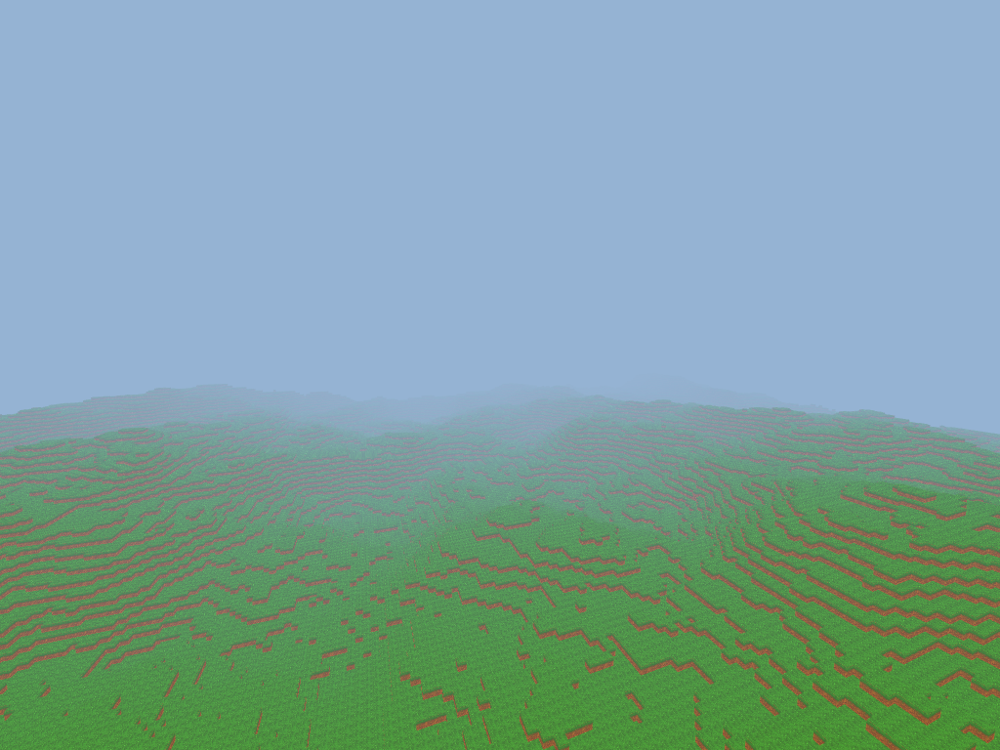
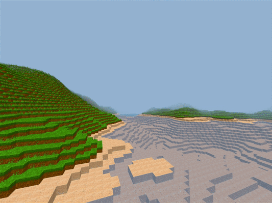

## Voxel Game

This is a personal side project to learn some concepts about computer graphics, game development and get more comfortable using Rust.

### Features

- World subdivision and interaction
- Procedural terrain generation
- Multi-threaded terrain and mesh generation
- Transparent blocks and depth sorting
- Custom meshes
- Frustum culling

## Controls
  - `WASD`  to move around
  - `Space/Shift` to go up/down

## Screenshots

| Version 0.1.0 | Version 0.1.1 |
| :---: | :---: |
|  |  |

| latest |
| :---: |
|  |

## Contributing
Pull requests are welcome. For major changes, please open an issue first to discuss what you would like to change.

## License
[GNU GPLv3](https://www.gnu.org/licenses/gpl-3.0.en.html)
